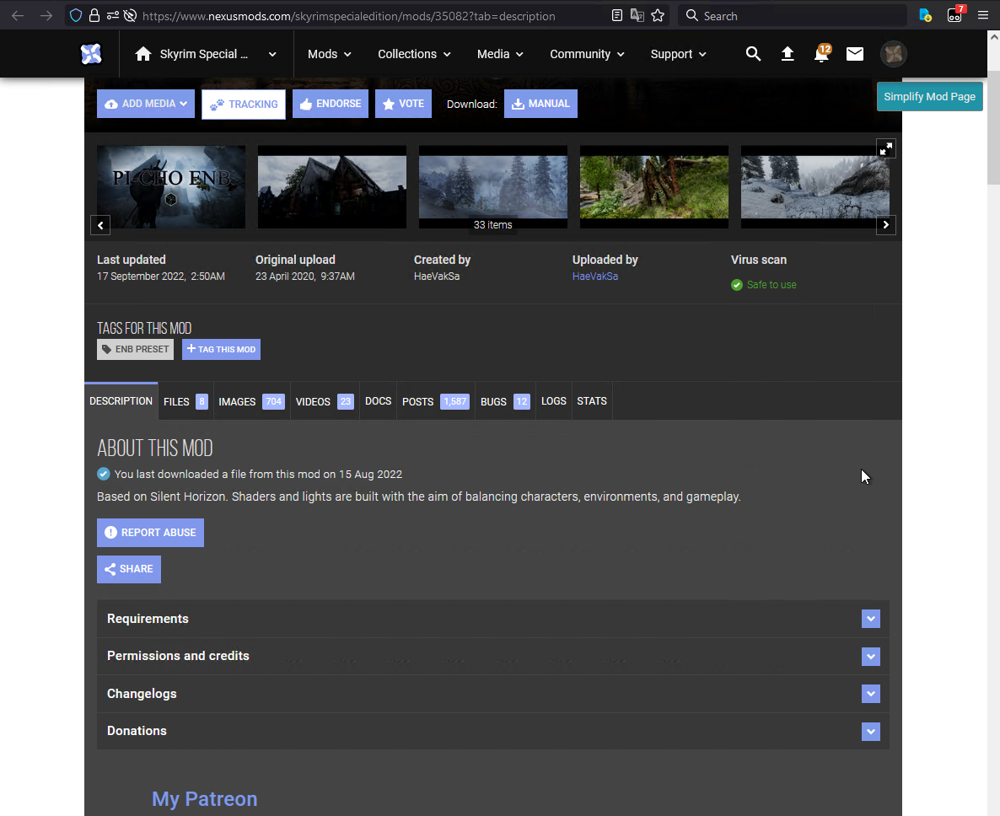
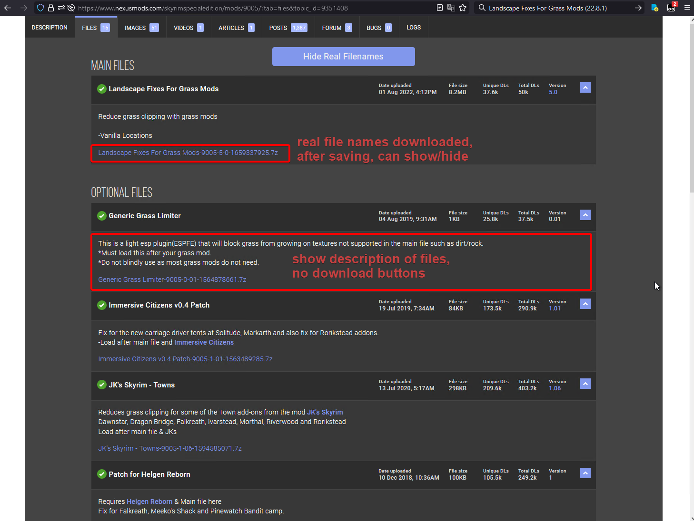
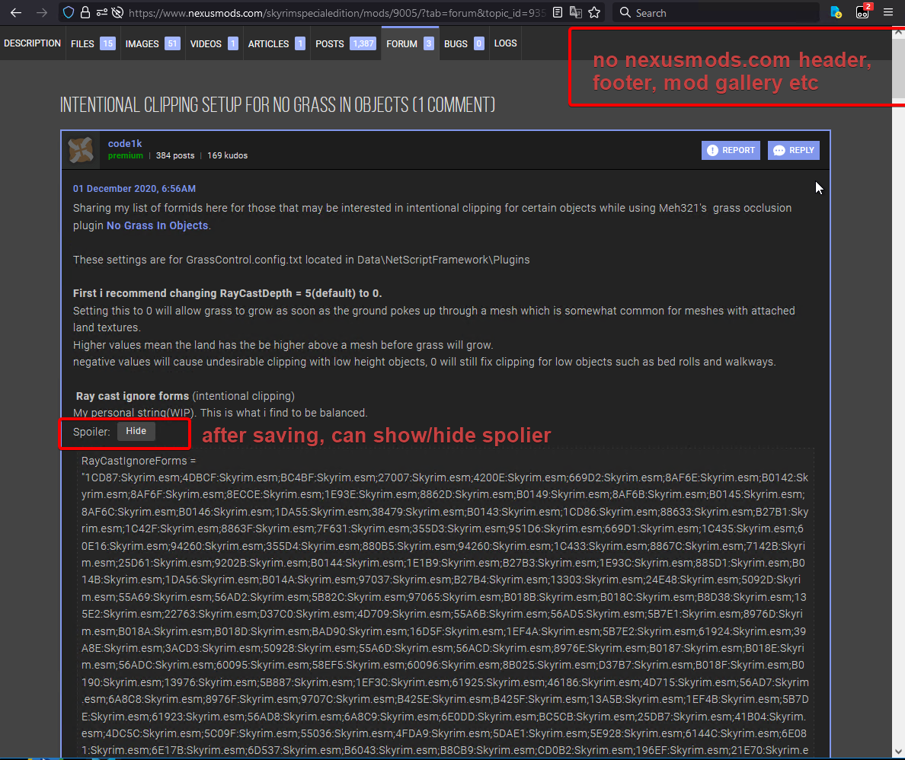
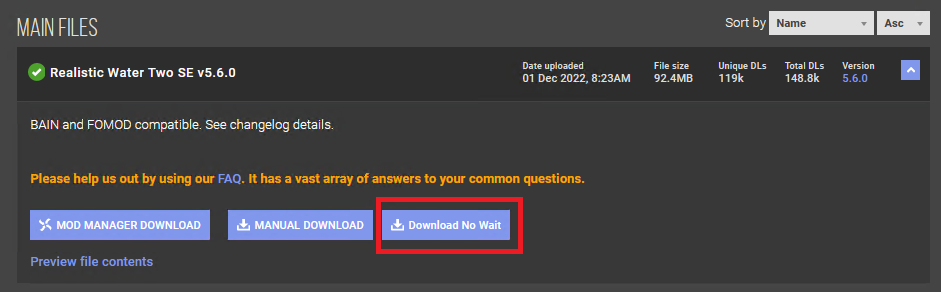
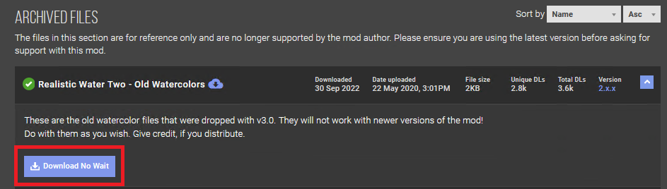

- [nexusmods\_com\_relative](#nexusmods_com_relative)
  - [UserScript: Mod Documentations Utility by Sylin527](#userscript-mod-documentations-utility-by-sylin527)
    - [Brief Overview](#brief-overview)
    - [Installation](#installation)
    - [Tweak Page Title](#tweak-page-title)
    - [Copy Mod Name And Version (With Date Last Updated)](#copy-mod-name-and-version-with-date-last-updated)
    - [Simplify Mod Page](#simplify-mod-page)
    - [Tweak Location to Standard Mod URL If Description Tab](#tweak-location-to-standard-mod-url-if-description-tab)
    - [Show All Thumbnails](#show-all-thumbnails)
    - [Simplify Files Tab](#simplify-files-tab)
    - [Simplify Archived Files Tab](#simplify-archived-files-tab)
    - [Simplify Posts Tab](#simplify-posts-tab)
    - [Simplify Forum Topic Tab](#simplify-forum-topic-tab)
    - [Simplify Article Page](#simplify-article-page)
    - [Changelogs](#changelogs)
      - [0.2.0.23.2.16](#02023216)
      - [0.1.3.2022.9.20](#0132022920)
      - [0.1.2.2022.9.19](#0122022919)
      - [0.1.1.beta.2022.9.17](#011beta2022917)
  - [UserScript: Download No Wait by sylin527](#userscript-download-no-wait-by-sylin527)
    - [Brief Overview](#brief-overview-1)
    - [Installation](#installation-1)
    - [Changelogs](#changelogs-1)
      - [0.2.0.23.2.17](#02023217)
      - [0.1.0.23.1.25](#01023125)
  - [Development](#development)

# nexusmods_com_relative

Personal resources relative to nexusmods.com.

## UserScript: Mod Documentations Utility by Sylin527

### Brief Overview

Help to save the mod documentations to local disk.

Simplify mod page, files tab, posts tab, forum tab, article page.

Show requirements, changelogs, file descriptions and spoilers.

Replace thumbnails to original, replace embedded YouTube videos to links.

Remove unnecessary contents, such as page header, footer of nexusmods.com.

Remove mod base info content if it is not mod page.

After saving s those pages by SingleFile, you can show/hide requirements, changelogs, spoilers, real file names downloaded, etc.

### Installation

The locate of this UserScript is English.

- **Method 1**

  Install [sylin527's Mod Documentations Utility](https://greasyfork.org/en/scripts/451506-sylin527-s-mod-documentations-utility) from greasyfork.org.

- **Method 2**

  Go to [greasyfork.org](https://greasyfork.org/scripts/by-site/nexusmods.com?filter_locale=0) for _nexusmods.com_, show all languages, then find "**sylin527's Mod Documentations Utility**" and install.

### Tweak Page Title

In mod page(description tab), tweak title to this format:

`<mod_name> <mod_version>(<date_last_updated>): <brief_overview>`

In other tabs(files, posts, etc), tweak title to this format:

`<mod_name> <mod_version>(<date_last_updated>) tab=<tab>`

Example: Open <https://www.nexusmods.com/skyrim/mods/88876>

In mod page(description tab), title is:

```text
Unbelievable Grass 2 Redux 1.3.6(18.2.9): This is a rework and update to the Unbelievable Grass 2 mod. Adds many grasses (with a high variety) to the different regions of Skyrim. The grasses were carefully choosen to fit the different regions. It was build on a tweak for better performance, while still providing high grass density.
```

In files tab, title is:

```text
Unbelievable Grass 2 Redux 1.3.6(18.2.9) tab=files
```

### Copy Mod Name And Version (With Date Last Updated)


In mod page(description tab), copy title to this format:

`<mod_name> <mod_version>(<date_last_updated>)`

Example: Open <https://www.nexusmods.com/skyrim/mods/88876>

Copy `Unbelievable Grass 2 Redux 1.3.6(18.2.9)` to clipboard.

### Simplify Mod Page

Show spoilers, requirements, changelogs etc.

Replace thumbnails to original, replace embedded YouTube videos to links.

**Mod Page not simplified 1**



**Mod Page simplified 1**


**Mod Page not simplified 2**


**Mod Page simplified 2**


### Tweak Location to Standard Mod URL If Description Tab

Standard Mod URL is like `https://www.nexusmods.com/skyrimspecialedition/mods/85880`.

`tab=description` URL is like `https://www.nexusmods.com/skyrimspecialedition/mods/85880?tab=description`.

But both of them are Mod page URL, it not convenient for bookmark management, we don't need duplicated bookmarks.

So this Userscript will **Tweak Location to Standard Mod URL If Description Tab** for bookmark management.

### Show All Thumbnails

If not working, resize you window then click the button again.

This issues may be fixed in future.

### Simplify Files Tab

Show description of files, spoilers and real file names downloaded.

Replace thumbnails to original, replace embedded YouTube videos to links.

**Files Tab not simplified**


**Files Tab simplified**



### Simplify Archived Files Tab

Go to `https://www.nexusmods.com/skyrimspecialedition/users/myaccount/?tab=api` page to request an API key.

### Simplify Posts Tab

Show spoilers.

Remove non-sticky comments.

Replace thumbnails to original, replace embedded YouTube videos to links.

### Simplify Forum Topic Tab

Show spoilers.

Remove non-author comments.

Replace thumbnails to original, replace embedded YouTube videos to links.

Example:

open <https://www.nexusmods.com/skyrimspecialedition/mods/9005/?tab=forum&topic_id=9351408>

**Forum Tab not simplified**


**Forum Tab simplified**



### Simplify Article Page

Show spoilers.

Remove comments.

Replace thumbnails to original, replace embedded YouTube videos to links.

### Changelogs

#### 0.2.0.23.2.16

- Now support show real filename of archived files tab

  Your Must Configure The `apikey` Value of Userscript Storage.

- Tweak Location to Standard Mod URL If Description Tab
- File Tab: Can Remove Old Files
- Forum Topic Tab And Article Page: Reserve First-level Sticky And Author Comments
- Show All Thumbnails
- Other improvements
- Refactor source code for maintainability

#### 0.1.3.2022.9.20

- Fix the small height value of mod name title. Now has more space belong mod category and mod stats like nexusmods.com original.
- Fix the hidden mod name title. Now show.

#### 0.1.2.2022.9.19

- Fix the incorrect position of copy button when mod name is long (multiline).
- Fix the removement of nested non-sticky comments of sticky comments in forum or posts tab. Now not remove.
- Fix the multi YouTube links in one line and no space separator. Now each YouTube link one line when multi embedded YouTube videos adjacent.

#### 0.1.1.beta.2022.9.17

Initial release.

## UserScript: Download No Wait by sylin527

### Brief Overview

Download mod files no wait.

No memory leak, performance.

When you open mod files page or click files tab, it will add buttons, texted "Download No Wait", below file description.



Also works on archived files.



### Installation

The locate of this UserScript is English.

- **Method 1**

  Install [Download No Wait by sylin527](https://greasyfork.org/zh-CN/scripts/458874-download-no-wait-by-sylin527) from greasyfork.org.

- **Method 2**

  Go to [greasyfork.org](https://greasyfork.org/scripts/by-site/nexusmods.com?filter_locale=0) for _nexusmods.com_, show all languages, then find "**Download No Wait by sylin527**" and install.

### Changelogs

#### 0.2.0.23.2.17

- Add "Download No Wait" button to file link page.
- Add downloaded icon and datetime to file header after clicking the "Download No Wait" button.

#### 0.1.0.23.1.25

Initial release.

## Development

- Install **Deno**

  Download Deno from [Deno GitHub Releases](https://github.com/denoland/deno/releases).

- Install **esbuild** module and distribute executable code

  ```bash
  deno install --allow-all --name esbuild "https://deno.land/x/esbuild/mod.js"
  ```

  If existing installation found, use -f to overwrite.

  ```bash
  deno install -f --allow-all --name esbuild "https://deno.land/x/esbuild/mod.js"
  ```

- Build Userscripts

  Open this project, run corresponding task.

  Then open folder `${projectDirectory}/build/userscripts` to see userscript.

  - Build UserScript: Mod Documentations Utility by Sylin527

    ```bash
    deno task build_mod_documentation_utility
    ```

  - Build UserScript: Download No Wait by sylin527

    ```bash
    deno task build_download_no_wait
    ```

