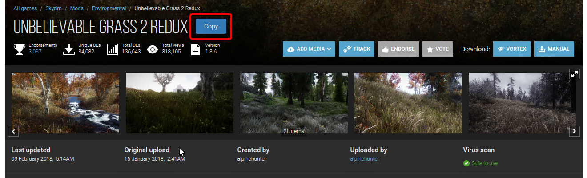
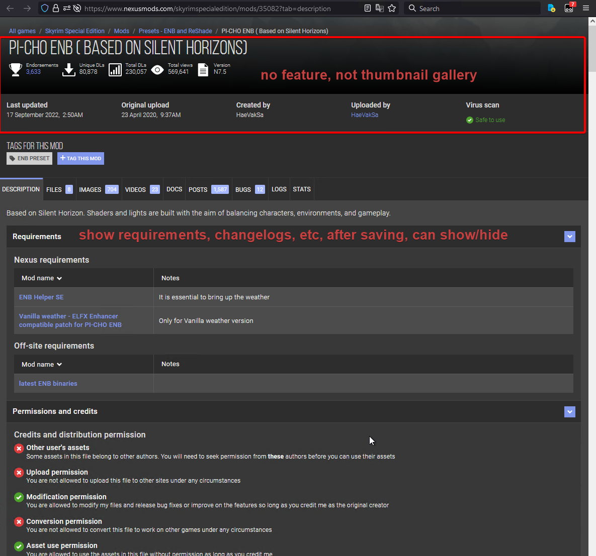
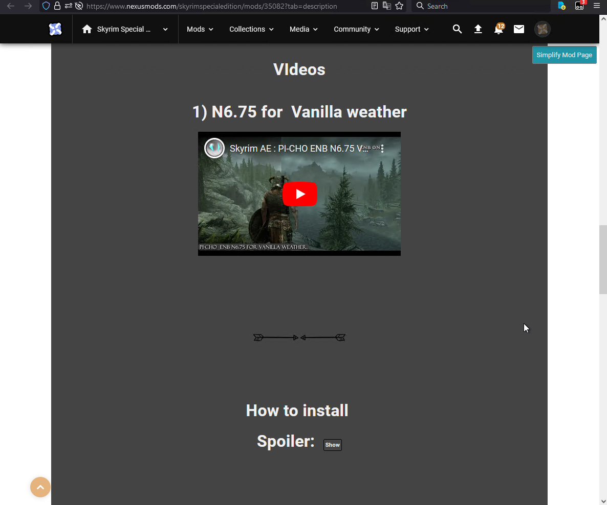
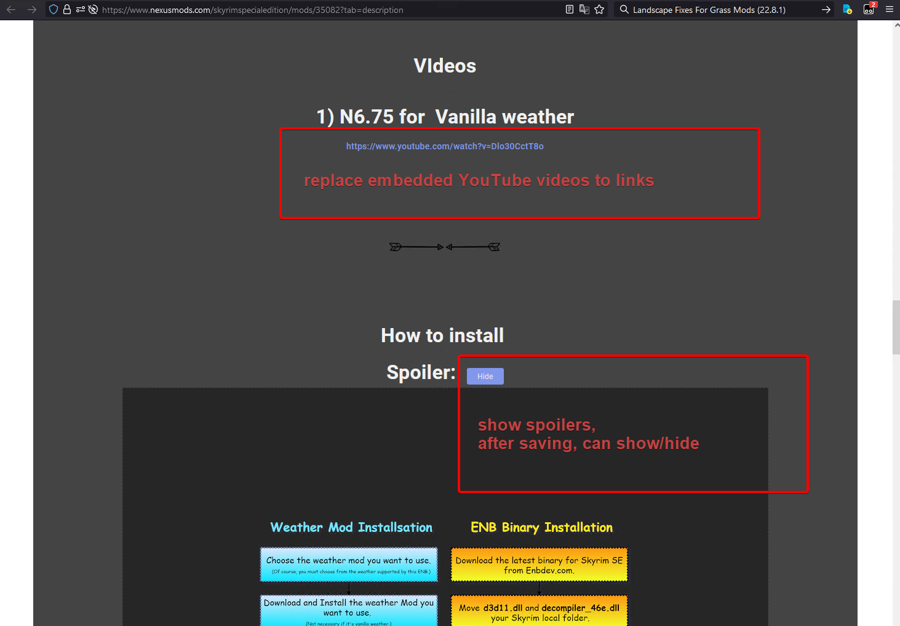
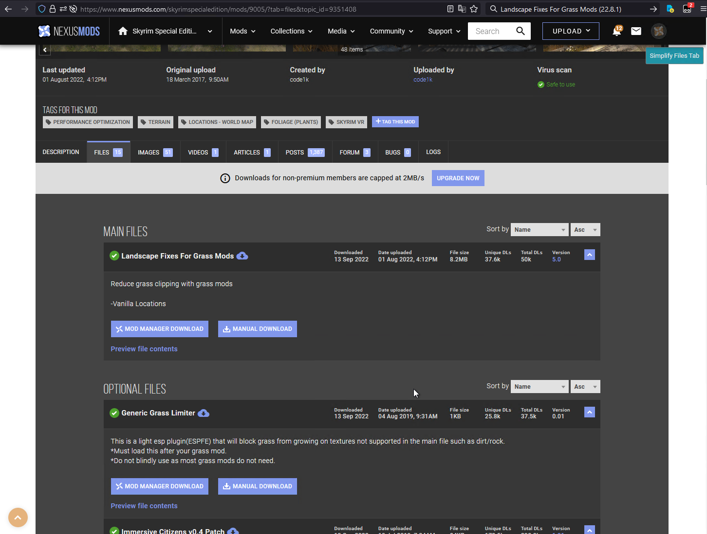
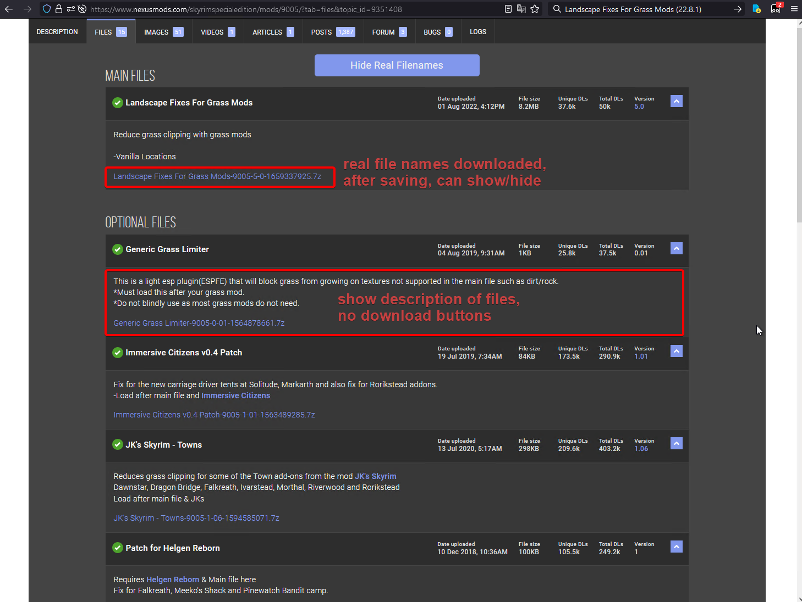
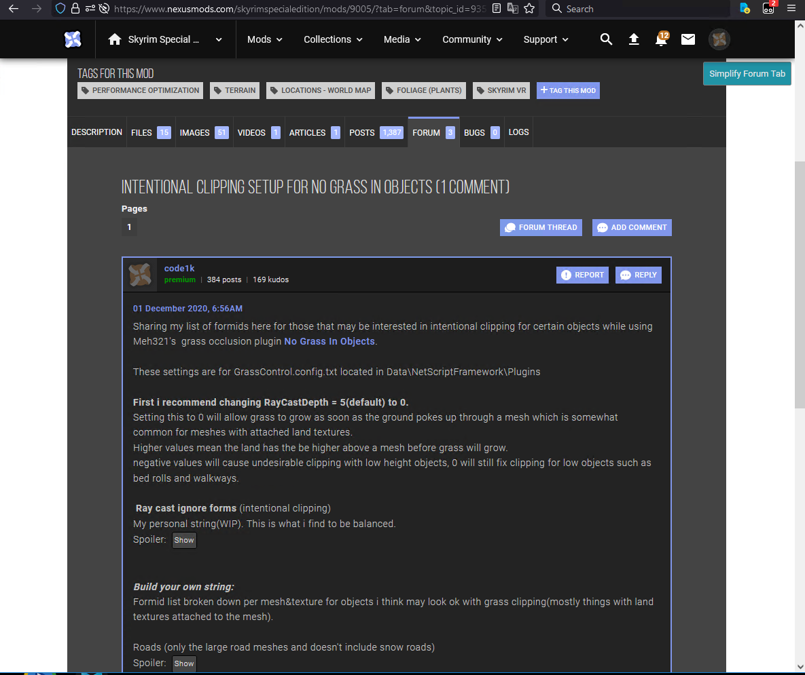
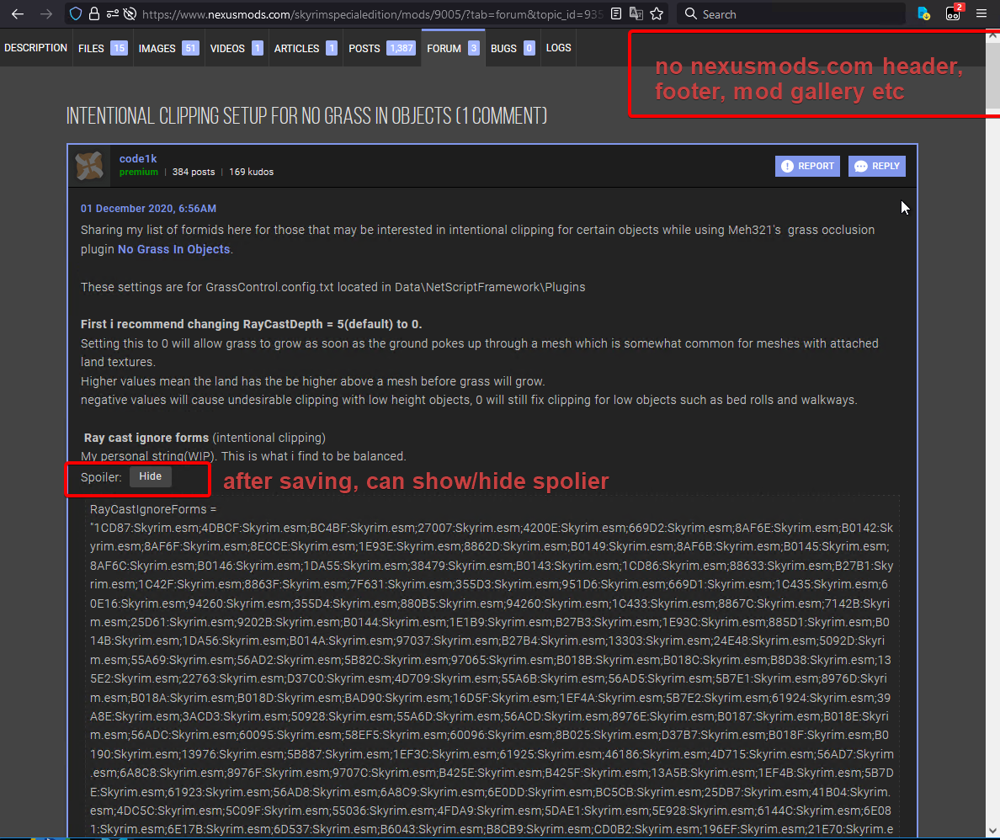

# nexusmods_com_relative

Personal resources relative to nexusmods.com.

Now just a UserScript: Mod Documentations Utility.

## UserScript: sylin527's Mod Documentations Utility

### Brief Overview

Help to save the mod documentations to local disk.

Simplify mod page, files tab, posts tab, forum tab, article page.

Show requirements, changelogs, file descriptions and spoilers.

Replace thumbnails to original, replace embedded YouTube videos to links.

Remove unnecessary contents, such as page header, footer of nexusmods.com.

Remove mod base info content if it is not mod page.

After saving s those pages by SingleFile, you can show/hide requirements, changelogs, spoilers, real file names downloaded, etc.

### Installation

The locate of this UserScript is English.

- **Method 1**

  Install [sylin527's Mod Documentations Utility](https://greasyfork.org/en/scripts/451506-sylin527-s-mod-documentations-utility) from greasyfork.org.

- **Method 2**

  Go to [greasyfork.org](https://greasyfork.org/scripts/by-site/nexusmods.com?filter_locale=0) for *nexusmods.com*, show all languages, then find "**sylin527's Mod Documentations Utility**" and install.

### Tweak Page Title

In mod page(description tab), tweak title to this format:

`<mod_name> <mod_version>(<date_last_updated>): <brief_overview>`

In other tabs(files, posts, etc), tweak title to this format:

`<mod_name> <mod_version>(<date_last_updated>) tab=<tab>`

Example: Open <https://www.nexusmods.com/skyrim/mods/88876>

In mod page(description tab), title is:

```text
Unbelievable Grass 2 Redux 1.3.6(18.2.9): This is a rework and update to the Unbelievable Grass 2 mod. Adds many grasses (with a high variety) to the different regions of Skyrim. The grasses were carefully choosen to fit the different regions. It was build on a tweak for better performance, while still providing high grass density.
```

In files tab, title is:

```text
Unbelievable Grass 2 Redux 1.3.6(18.2.9) tab=files
```

### Copy Mod Name And Version (With Date Last Updated)



In mod page(description tab), copy title to this format:

`<mod_name> <mod_version>(<date_last_updated>)`

Example: Open <https://www.nexusmods.com/skyrim/mods/88876>

Copy `Unbelievable Grass 2 Redux 1.3.6(18.2.9)` to clipboard.

### Simplify Mod Page

Show spoilers, requirements, changelogs etc.

Replace thumbnails to original, replace embedded YouTube videos to links.

**Mod Page not simplified 1**


**Mod Page simplified 1**



**Mod Page not simplified 2**



**Mod Page simplified 2**



### Simplify Files Tab

Show description of files, spoilers and real file names downloaded.

Replace thumbnails to original, replace embedded YouTube videos to links.

**Files Tab not simplified**



**Files Tab simplified**



### Simplify Posts Tab

Show spoilers.

Remove non-sticky comments.

Replace thumbnails to original, replace embedded YouTube videos to links.

### Simplify Forum Tab

Show spoilers.

Remove non-author comments.

Replace thumbnails to original, replace embedded YouTube videos to links.

Example:

open <https://www.nexusmods.com/skyrimspecialedition/mods/9005/?tab=forum&topic_id=9351408>

**Forum Tab not simplified**



**Forum Tab simplified**



### Simplify Article Page

Show spoilers.

Remove comments.

Replace thumbnails to original, replace embedded YouTube videos to links.

## Changelogs

### 0.1.3.2022.9.20

- Fix the small height value of mod name title. Now has more space belong mod category and mod stats like nexusmods.com original.
- Fix the hidden mod name title. Now show.

### 0.1.2.2022.9.19

- Fix the incorrect position of copy button when mod name is long (multiline).
- Fix the removement of nested non-sticky comments of sticky comments in forum or posts tab. Now not remove.
- Fix the multi YouTube links in one line and no space separator. Now each YouTube link one line when multi embedded YouTube videos adjacent.
### 0.1.1.beta.2022.9.17

Initial release.
